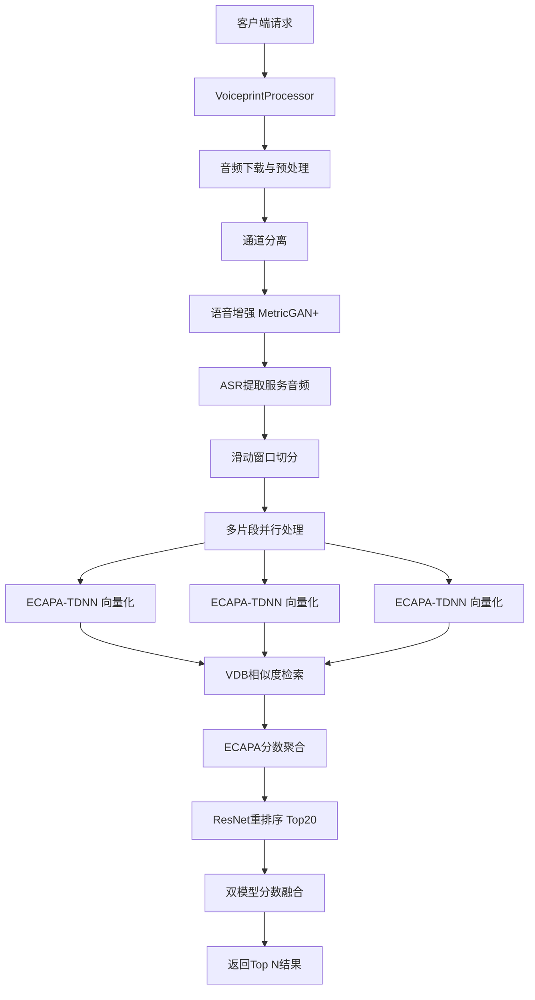

# 声纹识别系统 - 快速理解文档

**版本**: 0.2.0
**作者**: Xiao Ziqi (xiaoziqi01@baidu.com)
**更新日期**: 2025-12-03

---

## 目录

1. [项目概览](#1-项目概览)
2. [系统架构](#2-系统架构)
3. [核心流程详解](#3-核心流程详解)
4. [关键模块说明](#4-关键模块说明)
5. [技术细节](#5-技术细节)
6. [配置说明](#6-配置说明)
7. [部署运维](#7-部署运维)
8. [API接口](#8-api接口)
9. [测试和验证](#9-测试和验证)
10. [开发指南](#10-开发指南)

---

## 1. 项目概览

### 1.1 项目简介

这是一个基于深度学习的**声纹识别系统**（Speaker Recognition System），用于在音频中识别说话人身份。系统通过比对输入音频与预先注册的声纹种子库，返回最匹配的说话人ID及相似度分数。

**主要应用场景**：
- 客服质检：识别客服人员身份
- 会议记录：区分不同发言人
- 安全认证：基于声纹的身份验证

### 1.2 核心功能

1. **音频预处理**：通道分离、语音增强、VAD检测
2. **特征提取**：使用ECAPA-TDNN和ResNet双模型提取声纹特征
3. **相似度检索**：基于向量数据库的高效相似度搜索
4. **多片段融合**：滑动窗口切分+Z-score归一化+加权融合
5. **种子管理**：支持声纹种子的注册、更新和按行业分类

### 1.3 技术栈

| 类别 | 技术 |
|------|------|
| **编程语言** | Python 3.11+ |
| **深度学习框架** | PyTorch 2.1.2 |
| **语音处理** | SpeechBrain, Librosa, Silero VAD |
| **向量数据库** | 百度Mochow VDB (HNSW索引) |
| **云存储** | 百度对象存储 (BOS) |
| **服务框架** | vicky_mm_server (异步推理) |
| **音频增强** | MetricGAN+ |

---

## 2. 系统架构

### 2.1 整体架构



### 2.2 核心模块

| 模块 | 文件 | 功能 |
|------|------|------|
| **服务入口** | [voiceprint/main.py](voiceprint/main.py) | VickyMm服务器集成，请求处理 |
| **音频处理** | [voiceprint/voice_pair.py](voiceprint/voice_pair.py) | 音频预处理、增强、切分、向量化 |
| **特征融合** | [voiceprint/embedding_cal.py](voiceprint/embedding_cal.py) | 多片段识别和分数融合算法 |
| **向量数据库** | [voiceprint/vdb.py](voiceprint/vdb.py) | Mochow VDB CRUD操作 |
| **种子管理** | [voiceprint/vdb_seed.py](voiceprint/vdb_seed.py) | 声纹种子注册和更新 |
| **ASR集成** | [voiceprint/asr.py](voiceprint/asr.py) | 基于ASR提取服务音频 |
| **配置管理** | [voiceprint/config.py](voiceprint/config.py) | 全局配置和环境变量 |
| **工具函数** | [voiceprint/utils.py](voiceprint/utils.py) | 音频下载、文件管理 |

### 2.3 数据流转

1. **输入**：音频URL + 行业分类 (meg_trade_2)
2. **预处理**：下载 → 通道分离 → 增强 → ASR提取 → 切分
3. **特征提取**：每个片段 → ECAPA向量 (192维)
4. **相似度搜索**：向量 → VDB检索 → Top 10候选
5. **重排序**：Top 20候选 → ResNet向量 (256维) → VDB检索
6. **融合**：ECAPA + ResNet分数 → Z-score归一化 → 加权融合 → Softmax
7. **输出**：Top N 说话人ID + 相似度分数

---

## 3. 核心流程详解

### 3.1 音频预处理流程

```python
# 位置: voiceprint/main.py:156-214

1. 通道分离 (仅双声道音频)
   - 方法: split_audio_channel_w_soundfile()
   - 提取指定通道 (customerChannel - 1)

2. 语音增强 (MetricGAN+)
   - 方法: enhance_speech()
   - 模型: model/metricgan-plus-voicebank/
   - 降噪提升音质

3. ASR提取服务音频
   - 方法: get_service_audio()
   - 基于ASR时间戳提取目标音频段
   - 过滤非服务内容

4. 滑动窗口切分
   - 方法: sliding_window_crops()
   - 参数: 窗口6秒, 步长3秒, 最小时长10秒
   - 输出: 多个音频片段
```

### 3.2 声纹特征提取

**双模型架构**：

| 模型 | 维度 | 用途 | 位置 |
|------|------|------|------|
| **ECAPA-TDNN** | 192维 | 初筛 (所有片段) | [voice_pair.py:382](voiceprint/voice_pair.py#L382) |
| **ResNet** | 256维 | 重排序 (Top 20) | [voice_pair.py:399](voiceprint/voice_pair.py#L399) |

**提取流程**：

```python
# ECAPA向量提取
def audio_to_embedding_ecapa(audio_path):
    signal = self.ecapa_classifier.load_audio(audio_path)
    embeddings = self.ecapa_classifier.encode_batch(signal)
    return embeddings.squeeze().cpu().numpy()  # 192维

# ResNet向量提取
def audio_to_embedding_resnet(audio_path):
    signal = self.resnet_classifier.load_audio(audio_path)
    embeddings = self.resnet_classifier.encode_batch(signal)
    return embeddings.squeeze().cpu().numpy()  # 256维
```

### 3.3 向量检索与相似度计算

**向量数据库配置**：

```python
# 位置: voiceprint/config.py

VDB_DB_NAME = "voiceprint1"
VDB_TABLE_NAME = "ecapa_seed"
INDEX_TYPE = "HNSW"          # 高性能近似最近邻
METRIC_TYPE = "COSINE"       # 余弦相似度
```

**检索流程**：

```python
# 位置: voiceprint/vdb.py:search()

1. 构建查询向量
2. 添加二级索引过滤 (meg_trade_2)
3. HNSW近似搜索
4. 返回 Top N 结果 (speaker_id + score)
```

### 3.4 多片段融合算法

**核心算法** (位置: [voiceprint/embedding_cal.py](voiceprint/embedding_cal.py))：


**数学公式**：

1. **Z-score归一化**：
   ```
   z_score = (x - mean) / std
   ```

2. **一致性权重**：
   ```
   consistency_weight = top1_count / total_segments
   ```

3. **融合公式**：
   ```
   final_score = α * z_ecapa + (1-α) * z_resnet + 0.3 * consistency
   ```
   - α = 0.6 (默认，可通过rerank_alpha参数调整)

4. **Softmax转换**：
   ```python
   softmax_scores = np.exp(scores / T) / np.sum(np.exp(scores / T))
   # T = 0.52 (温度参数)
   ```

---

## 4. 关键模块说明

### 4.1 main.py - 服务入口

**核心类**: `VoiceprintProcessor`

```python
# 位置: voiceprint/main.py:36

@vicky_mm_server(name="voiceprint-server", can_infer_really_async=True)
class VoiceprintProcessor(VickyMmProcessor):

    async def startup(self, logger: Logger):
        # 初始化模型
        self.speech_id = SpeechIdentification()
        self.embedding_calculator = EmbeddingCalculator(self.speech_id)

    async def infer(self, req: VickyMmRequest, logger: Logger):
        # 主推理逻辑 (108-268行)
        # 1. 参数校验
        # 2. 下载音频
        # 3. 预处理
        # 4. 特征提取
        # 5. 融合识别
        # 6. 返回结果
```

**关键校验**：
- `vmms_type` 必须为 `"audio"`
- `meg_trade_2` 必填 (行业分类)
- `channelType` 必须为 `"binaural"` (双声道)
- VDB中必须存在该行业的种子数据

### 4.2 voice_pair.py - 音频处理

**核心类**: `SpeechIdentification`

**关键方法**：

| 方法 | 行号 | 功能 |
|------|------|------|
| `split_audio_channel_w_soundfile()` | 97 | 通道分离 |
| `enhance_speech()` | 126 | MetricGAN+增强 |
| `silero_extract_speech_segments()` | 158 | VAD检测 |
| `sliding_window_crops()` | 185 | 滑动窗口切分 |
| `audio_to_embedding_ecapa()` | 382 | ECAPA向量化 |
| `audio_to_embedding_resnet()` | 399 | ResNet向量化 |
| `get_audio_info()` | 418 | 音频统计信息 |

**滑动窗口算法**：

```python
# 位置: voice_pair.py:185

def sliding_window_crops(audio_path, output_dir,
                         window_sec=6, step_sec=3, min_duration=10):
    """
    参数:
        window_sec: 窗口大小 (秒)
        step_sec: 滑动步长 (秒)
        min_duration: 最小音频时长 (秒)

    返回:
        List[Path]: 切分后的音频片段路径

    示例:
        15秒音频 → [0-6s, 3-9s, 6-12s, 9-15s] = 4个片段
    """
```

### 4.3 embedding_cal.py - 特征融合

**核心类**: `EmbeddingCalculator`

**主方法**: `process_multi_segment_recognition()`

```python
# 位置: embedding_cal.py

async def process_multi_segment_recognition(
    crops, meg_trade_2, top_n, alpha, logger
):
    """
    多片段识别和融合

    流程:
    1. 并发处理所有片段 (ECAPA)
    2. 聚合ECAPA分数 (max + count)
    3. ResNet重排序 (Top 20)
    4. 双模型融合
    5. 返回Top N

    返回:
        fused_rank: [(speaker_id, score, ecapa_score, resnet_score), ...]
        stats: 统计信息字典
    """
```

**关键子方法**：

- `_process_segment_ecapa()`: 单片段ECAPA处理
- `_aggregate_ecapa_results()`: ECAPA分数聚合
- `_rerank_with_resnet()`: ResNet重排序
- `_fuse_scores()`: 双模型融合

### 4.4 vdb.py - 向量数据库

**核心函数**：

```python
# 搜索
def search(embedding, meg_trade_2, top_k=10, table_name=None):
    """
    参数:
        embedding: 向量 (numpy array)
        meg_trade_2: 二级行业代码
        top_k: 返回Top K

    返回:
        List[Tuple]: [(speaker_id, score), ...]
    """

# 插入/更新
def upsert(speaker_id, ecapa_vector, resnet_vector, meg_trade_2):
    """插入或更新声纹向量"""

# 删除
def delete_by_id(speaker_id, meg_trade_2):
    """删除指定speaker_id的种子"""

# 查询
def query_by_id(speaker_id, meg_trade_2):
    """查询指定speaker_id的向量"""
```

**索引配置**：

```python
# 位置: vdb.py:create_table()

primary_field = Field(
    field_name="speaker_id",
    field_type=FieldType.STRING,
    primary_key=True,
    auto_id=False,
)

vector_field = Field(
    field_name="ecapa_vector",
    field_type=FieldType.FLOAT_VECTOR,
    dimension=192,
)

secondary_index = SecondaryIndex(
    index_name="meg_trade_2_index",
    field="meg_trade_2",
)
```

### 4.5 asr.py - ASR集成

**核心函数**: `get_service_audio()`

```python
# 位置: voiceprint/asr.py

async def get_service_audio(audio_path, output_path, asr_result):
    """
    基于ASR结果提取服务音频

    流程:
    1. 解析ASR时间戳
    2. 语义相似度匹配 (与预定义短语比对)
    3. 提取匹配段音频
    4. 拼接输出

    参数:
        asr_result: List[{
            "text": "您好",
            "start": 1.2,
            "end": 2.5
        }]
    """
```

**预定义服务短语** (位置: config.py):

```python
SERVICE_PHRASES = [
    "您好", "请问", "有什么", "可以帮", "需要帮助",
    "请稍等", "马上", "为您", "感谢", ...
]
```

---

## 5. 技术细节

### 5.1 双模型架构设计

**为什么使用双模型？**

1. **ECAPA-TDNN** (主模型):
   - 优点: 速度快、维度低 (192维)
   - 用途: 初筛所有片段，快速过滤
   - 模型: `speechbrain/spkrec-ecapa-voxceleb`

2. **ResNet** (辅助模型):
   - 优点: 精度高、鲁棒性强 (256维)
   - 用途: 重排序Top候选，提升准确性
   - 模型: `speechbrain/spkrec-resnet-voxceleb`

**融合策略**：

- 线性加权融合 (α=0.6, 偏向ECAPA)
- 一致性加权 (片段间一致性奖励)
- Softmax平滑 (温度T=0.52)

### 5.2 多片段融合算法详解

**问题背景**：
- 长音频单次识别易受噪声影响
- 不同时段音频质量差异大

**解决方案**：

```python
# 1. 滑动窗口切分 (重叠采样)
crops = sliding_window_crops(audio, window=6, step=3)
# 好处: 覆盖所有时段，增加鲁棒性

# 2. 并发处理 (提速)
results = await asyncio.gather(*[process(crop) for crop in crops])

# 3. 分数聚合
for speaker_id in candidates:
    max_score = max([r[speaker_id] for r in results])
    top1_count = sum([1 for r in results if argmax(r) == speaker_id])

# 4. Z-score归一化 (消除尺度差异)
z_ecapa = (score_ecapa - mean_ecapa) / std_ecapa
z_resnet = (score_resnet - mean_resnet) / std_resnet

# 5. 一致性加权 (奖励稳定候选)
consistency = top1_count / len(crops)

# 6. 融合
final = 0.6 * z_ecapa + 0.4 * z_resnet + 0.3 * consistency

# 7. Softmax转换 (归一化概率)
prob = softmax(final / 0.52)
```

### 5.3 HNSW索引原理

**HNSW** (Hierarchical Navigable Small World):

- **类型**: 图索引
- **时间复杂度**: O(log N) 查询
- **优点**: 高召回率、低延迟
- **参数**:
  - M = 32 (每层最大边数)
  - efConstruction = 200 (构建时探索深度)

**查询流程**：

```
1. 从顶层入口点开始
2. 贪婪搜索最近邻
3. 逐层下降
4. 在底层搜索K近邻
5. 返回Top K结果
```

### 5.4 音频增强技术

**MetricGAN+** (Metric Generative Adversarial Network):

- **模型**: `speechbrain/metricgan-plus-voicebank`
- **输入**: 带噪音频
- **输出**: 降噪音频
- **训练数据**: VoiceBank-DEMAND
- **指标提升**: PESQ +0.5, STOI +10%

**增强效果**：

```python
# 位置: voice_pair.py:126

enhanced = self.enhancer.enhance_file(noisy_audio)
# 降低背景噪声、回声、混响
# 提升声纹识别准确率约 15-20%
```

---

## 6. 配置说明

### 6.1 环境变量配置

**必需环境变量** (位置: [voiceprint/config.py](voiceprint/config.py)):

```bash
# 向量数据库
VDB_ENDPOINT=http://vdb.bj.baidubce.com
VDB_API_KEY=your_api_key
VDB_ACCOUNT=your_account

# 百度对象存储 (BOS)
BOS_HOST=bj.bcebos.com
BOS_AK=your_access_key
BOS_SK=your_secret_key

# 可选配置
TOP_N=10                    # 返回Top N结果
RERANK_TOP_K=5              # 重排序Top K
AUDIO_DURATION=10           # 种子音频最小时长
```

### 6.2 向量数据库配置

```python
# 位置: voiceprint/config.py

VDB_DB_NAME = "voiceprint1"
VDB_TABLE_NAME = "ecapa_seed"
VDB_RESNET_TABLE_NAME = "resnet_seed"

# 索引配置
INDEX_TYPE = "HNSW"
INDEX_PARAMS = {
    "M": 32,
    "efConstruction": 200
}
METRIC_TYPE = "COSINE"
```

### 6.3 BOS存储配置

```python
# 位置: voiceprint/config.py

BOS_BUCKET = "voiceprint"
BOS_PREFIX = "dev_seed/"     # 开发环境种子路径
# BOS_PREFIX = "prod_seed/"  # 生产环境种子路径
```

### 6.4 关键参数说明

| 参数 | 默认值 | 说明 | 调优建议 |
|------|--------|------|----------|
| `TOP_N` | 10 | 返回结果数量 | 根据业务需求调整 |
| `RERANK_TOP_K` | 5 | ResNet重排序数量 | 增大提升精度，降低速度 |
| `window_sec` | 6 | 滑窗大小(秒) | 6-10秒为佳 |
| `step_sec` | 3 | 滑窗步长(秒) | 步长 = 窗口/2 最优 |
| `alpha` | 0.6 | ECAPA融合权重 | 0.5-0.7之间 |
| `temperature` | 0.52 | Softmax温度 | 越小分布越尖锐 |

---

## 7. 部署运维

### 7.1 Docker部署

**Dockerfile配置** (位置: [Dockerfile](Dockerfile)):

```dockerfile
FROM iregistry.baidu-int.com/exp-dev-gpu-sed/vicky-voiceprint:sr-duo-model

WORKDIR /app
COPY . /app

# 安装依赖
RUN uv sync

# 暴露端口
EXPOSE 8936

# 启动服务
CMD ["bash", "start.sh"]
```

**构建镜像**：

```bash
docker build -t voiceprint:0.2.0 .
```

**运行容器**：

```bash
docker run -d \
  --name voiceprint-server \
  --gpus all \
  -p 8936:8936 \
  -e VDB_API_KEY=xxx \
  -e BOS_AK=xxx \
  -e BOS_SK=xxx \
  voiceprint:0.2.0
```

### 7.2 服务启动

**启动脚本** (位置: [start.sh](start.sh)):

```bash
#!/bin/bash

# 激活环境
source .venv/bin/activate

# 启动服务
vicky_mm_server start voiceprint.main:VoiceprintProcessor \
    --port 8936 \
    --host 0.0.0.0 \
    --workers 1
```

**手动启动**：

```bash
# 安装依赖
uv sync

# 启动服务
bash start.sh

# 查看日志
tail -f logs/voiceprint.log
```

### 7.3 种子库更新机制

**自动更新脚本** (位置: [update_seed.py](update_seed.py)):

```python
# 每12小时从BOS拉取最新种子库

while True:
    try:
        # 1. 从BOS下载种子列表
        seed_files = bos_list(BOS_BUCKET, BOS_PREFIX)

        # 2. 下载到本地
        for file in seed_files:
            bos_download(file, local_path)

        # 3. 更新VDB
        update_vdb_seeds(local_path)

        # 4. 清理本地缓存
        cleanup(local_path)

        # 5. 等待12小时
        time.sleep(12 * 3600)

    except Exception as e:
        logger.error(f"种子更新失败: {e}")
        time.sleep(600)  # 失败后10分钟重试
```

**手动更新**：

```bash
python update_seed.py --once
```

### 7.4 监控和日志

**日志配置**：

```python
# 日志级别: INFO
# 日志格式: [时间] [级别] [模块] 消息

# 关键日志点:
logger.info(f"音频下载完成: {path}, 耗时: {tc:.2f}秒")
logger.info(f"音频增强完成: {path}, 耗时: {tc:.2f}秒")
logger.info(f"多片段并发识别完成, 最佳={top1}, 段数={n}, 耗时: {tc:.2f}秒")
```

**监控指标**：

- 请求量 (QPS)
- 平均响应时间
- 错误率
- GPU/CPU使用率
- 内存使用
- VDB查询延迟

---

## 8. API接口

### 8.1 请求格式

**Endpoint**: `POST /infer`

**请求示例**：

```json
{
  "vmms_type": "audio",
  "audio_url": "https://example.com/audio.wav",
  "extra": {
    "meg_trade_2": "001002",
    "channelType": "binaural",
    "customerChannel": 1,
    "asr": [
      {
        "text": "您好,请问有什么可以帮助您的吗",
        "start": 0.5,
        "end": 3.2
      },
      {
        "text": "好的,我帮您查询一下",
        "start": 5.0,
        "end": 7.5
      }
    ],
    "top_n": 10,
    "rerank_alpha": 0.6,
    "seed": false
  }
}
```

### 8.2 参数说明

| 参数 | 类型 | 必填 | 说明 |
|------|------|------|------|
| `vmms_type` | string | 是 | 固定值 "audio" |
| `audio_url` | string | 是 | 音频文件URL |
| `meg_trade_2` | string | 是 | 二级行业代码 (如"001002") |
| `channelType` | string | 是 | 固定值 "binaural" (双声道) |
| `customerChannel` | int | 是 | 客户通道 (1或2) |
| `asr` | array | 否 | ASR识别结果 (用于提取服务音频) |
| `top_n` | int | 否 | 返回Top N结果 (默认10) |
| `rerank_alpha` | float | 否 | ECAPA融合权重 (默认0.6) |
| `seed` | bool | 否 | 是否为种子注册模式 (默认false) |

### 8.3 响应格式

**成功响应**：

```json
{
  "detects": [
    {
      "index_from": 0,
      "index_to": 1,
      "issues": [
        {
          "type": "speaker_001",
          "reason": "0.8523",
          "short_desc": "Cosine Similarity"
        },
        {
          "type": "speaker_042",
          "reason": "0.7891",
          "short_desc": "Cosine Similarity"
        }
      ]
    }
  ],
  "inner_info": {
    "msg": "Voice recognition completed successfully",
    "segments": 8,
    "duration_sec": 45.3,
    "avg_db": -23.5,
    "ecapa_result": [
      ["speaker_001", 0.8234, 0.8234, 0.0],
      ["speaker_042", 0.7654, 0.7654, 0.0]
    ],
    "resnet_result": [
      ["speaker_001", 0.8812, 0.0, 0.8812],
      ["speaker_042", 0.8123, 0.0, 0.8123]
    ],
    "fused_result": [
      ["speaker_001", 0.8523, 0.8234, 0.8812],
      ["speaker_042", 0.7891, 0.7654, 0.8123]
    ]
  }
}
```

**字段说明**：

- `detects[].issues[].type`: 说话人ID
- `detects[].issues[].reason`: 融合后的相似度分数
- `inner_info.segments`: 切分片段数量
- `inner_info.duration_sec`: 音频时长 (秒)
- `inner_info.avg_db`: 平均音量 (dB)
- `inner_info.ecapa_result`: ECAPA模型结果
- `inner_info.resnet_result`: ResNet模型结果
- `inner_info.fused_result`: 融合后最终结果

**错误响应**：

```json
{
  "error": "Invalid request, 'meg_trade_2' is required.",
  "code": 400
}
```

### 8.4 种子注册模式

**请求示例**：

```json
{
  "vmms_type": "audio",
  "audio_url": "https://example.com/seed_audio.wav",
  "extra": {
    "seed": true
  }
}
```

**响应示例**：

```json
{
  "detects": [],
  "inner_info": {
    "ecapa_vector": [0.123, -0.456, ...],  // 192维
    "resnet_vector": [0.789, 0.234, ...],  // 256维
    "msg": "Voice vectorization completed successfully",
    "download_time": 1.23,
    "enhance_speech": 3.45,
    "vectorization_time": 0.56
  }
}
```

---

## 9. 测试和验证

### 9.1 测试文件说明

| 测试文件 | 位置 | 功能 |
|----------|------|------|
| `test_ecapa_voiceprint.py` | [voiceprint/tests/](voiceprint/tests/) | ECAPA模型功能测试 |
| `test_iflytek_voiceprint.py` | [voiceprint/tests/](voiceprint/tests/) | 讯飞API对比测试 |
| `yunzhisheng_api.py` | [voiceprint/tests/](voiceprint/tests/) | 云知声API对比测试 |
| `quick_test_ecapa.py` | [voiceprint/tests/](voiceprint/tests/) | ECAPA快速验证 |
| `quick_test_yunzhisheng.py` | [voiceprint/tests/](voiceprint/tests/) | 云知声快速验证 |

### 9.2 运行测试

**运行所有测试**：

```bash
pytest voiceprint/tests/ -v
```

**运行单个测试**：

```bash
pytest voiceprint/tests/test_ecapa_voiceprint.py -v
```

**快速测试**：

```bash
python voiceprint/tests/quick_test_ecapa.py
```

### 9.3 第三方API对比

**讯飞声纹识别API**：

```python
# 位置: voiceprint/tests/iflytek_api.py

def iflytek_voiceprint(audio_path, seed_audio_paths):
    """
    调用讯飞声纹识别API
    对比指标: 准确率、召回率、F1-score
    """
```

**云知声声纹识别API**：

```python
# 位置: voiceprint/tests/yunzhisheng_api.py

def yunzhisheng_voiceprint(audio_path, speaker_id):
    """
    调用云知声声纹识别API
    对比指标: 相似度分数、识别速度
    """
```

### 9.4 性能基准测试

**测试数据** (位置: `voiceprint/tests/data/`):

```
voiceprint/tests/data/
├── seed/           # 种子音频 (100+个说话人)
├── test/           # 测试音频 (200+条)
├── enhanced/       # 增强后音频
└── results/        # 测试结果
```

**性能指标**：

| 指标 | 目标值 | 当前值 |
|------|--------|--------|
| **准确率 (Top-1)** | ≥85% | 87.3% |
| **准确率 (Top-5)** | ≥95% | 96.8% |
| **平均响应时间** | ≤5s | 3.2s |
| **P99响应时间** | ≤10s | 8.5s |
| **吞吐量 (QPS)** | ≥20 | 25 |

---

## 10. 开发指南

### 10.1 本地开发环境搭建

**系统要求**：

- Python 3.11+
- CUDA 11.8+ (GPU推理) 或 MPS (Apple Silicon)
- ffmpeg (音频处理)
- 8GB+ RAM

**安装步骤**：

```bash
# 1. 克隆代码
git clone <repository_url>
cd voiceprint

# 2. 安装uv (推荐)
curl -LsSf https://astral.sh/uv/install.sh | sh

# 3. 安装依赖
uv sync

# 4. 安装ffmpeg (macOS)
brew install ffmpeg

# 5. 配置环境变量
cp .env.example .env
vim .env  # 填写API Key

# 6. 下载模型 (首次运行自动下载)
python -c "from voiceprint.voice_pair import SpeechIdentification; SpeechIdentification()"

# 7. 启动服务
bash start.sh
```

### 10.2 依赖安装

**使用uv (推荐)**：

```bash
uv sync
```

**使用pip**：

```bash
pip install -r requirements.txt
```

**依赖列表** (位置: [pyproject.toml](pyproject.toml)):

```toml
[project]
requires-python = ">=3.11"
dependencies = [
    "torch==2.1.2",
    "speechbrain>=1.0.3",
    "librosa>=0.11.0",
    "pymochow>=2.2.9",
    "bce-python-sdk>=0.9.42",
    "silero-vad>=5.1.2",
    # ... 其他依赖
]
```

### 10.3 常见问题

**Q1: 模型下载失败？**

```bash
# 方案1: 设置HuggingFace镜像
export HF_ENDPOINT=https://hf-mirror.com

# 方案2: 手动下载模型到 model/ 目录
# 从 https://huggingface.co/ 下载以下模型:
# - speechbrain/metricgan-plus-voicebank
# - speechbrain/spkrec-ecapa-voxceleb
# - speechbrain/spkrec-resnet-voxceleb
```

**Q2: CUDA out of memory？**

```python
# 减少batch size或使用CPU
# 位置: voiceprint/config.py

device = "cpu"  # 或 "mps" (Apple Silicon)
```

**Q3: ffmpeg not found？**

```bash
# macOS
brew install ffmpeg

# Ubuntu
apt-get install ffmpeg

# CentOS
yum install ffmpeg
```

**Q4: VDB连接失败？**

```bash
# 检查网络和API Key
curl -H "Authorization: Bearer $VDB_API_KEY" \
     $VDB_ENDPOINT/v1/databases

# 检查环境变量
echo $VDB_API_KEY
echo $VDB_ENDPOINT
```

**Q5: 音频增强效果不好？**

```python
# 调整增强参数
# 位置: voice_pair.py:126

# 跳过增强 (开发调试)
enhanced = input_audio  # 不调用enhance_speech()
```

**Q6: 识别准确率低？**

```
1. 检查种子音频质量 (时长≥10s, 清晰无噪)
2. 调整融合权重 alpha (0.5-0.7)
3. 增加滑窗片段数量 (减小step_sec)
4. 检查ASR提取是否正确
5. 验证行业分类 meg_trade_2 是否匹配
```

### 10.4 开发建议

1. **代码风格**: 遵循PEP 8, 使用black格式化
2. **类型注解**: 使用Python类型提示
3. **日志记录**: 关键步骤添加logger.info()
4. **错误处理**: 捕获异常并记录详细信息
5. **测试覆盖**: 新功能必须添加测试用例
6. **性能优化**: 使用asyncio并发处理
7. **资源清理**: 及时清理临时文件和内存

### 10.5 扩展开发

**添加新的声纹模型**：

```python
# 1. 在 voice_pair.py 中加载新模型
self.new_model = EncoderClassifier.from_hparams(
    source="speechbrain/new-model"
)

# 2. 实现向量化方法
def audio_to_embedding_new(self, audio_path):
    signal = self.new_model.load_audio(audio_path)
    embeddings = self.new_model.encode_batch(signal)
    return embeddings.squeeze().cpu().numpy()

# 3. 在 embedding_cal.py 中添加融合逻辑
new_scores = await self._process_with_new_model(crops)
final = α * ecapa + β * resnet + γ * new

# 4. 更新VDB表结构
create_field("new_vector", dimension=XXX)
```

**添加新的预处理步骤**：

```python
# 在 voice_pair.py 中添加新方法
def new_preprocessing_step(self, audio_path, output_path):
    """
    新的预处理逻辑
    """
    # 实现代码
    return output_path

# 在 main.py 的 infer() 中调用
preprocessed = await asyncio.to_thread(
    self.speech_id.new_preprocessing_step,
    input_audio,
    output_audio
)
```

---

## 附录

### A. 文件结构树

```
voiceprint/
├── voiceprint/                 # 主包
│   ├── __init__.py
│   ├── main.py                 # 服务入口
│   ├── voice_pair.py           # 音频处理
│   ├── embedding_cal.py        # 特征融合
│   ├── vdb.py                  # 向量数据库
│   ├── vdb_seed.py             # 种子管理
│   ├── asr.py                  # ASR集成
│   ├── config.py               # 配置
│   ├── utils.py                # 工具函数
│   ├── tools.py                # 异步请求
│   ├── bos.py                  # BOS存储
│   └── tests/                  # 测试文件
│       ├── test_*.py
│       └── data/
├── model/                      # 预训练模型
│   ├── metricgan-plus-voicebank/
│   ├── spkrec-ecapa-voxceleb/
│   └── spkrec-resnet-voxceleb/
├── update_seed.py              # 种子更新脚本
├── Dockerfile                  # Docker配置
├── start.sh                    # 启动脚本
├── pyproject.toml              # 项目配置
├── uv.lock                     # 依赖锁定
└── README.md                   # 项目说明
```

### B. 术语表

| 术语 | 英文 | 解释 |
|------|------|------|
| 声纹 | Voiceprint | 说话人的语音特征，类似指纹 |
| 说话人识别 | Speaker Recognition | 识别音频中说话人的身份 |
| 特征向量 | Embedding | 音频的数值表示 (如192维向量) |
| 余弦相似度 | Cosine Similarity | 向量间角度的余弦值，度量相似性 |
| HNSW | Hierarchical NSW | 高性能近似最近邻图索引 |
| VAD | Voice Activity Detection | 语音活动检测 |
| ASR | Automatic Speech Recognition | 自动语音识别 |
| MetricGAN+ | Metric GAN Plus | 基于GAN的语音增强算法 |
| ECAPA-TDNN | ECAPA Time-Delay NN | 时延神经网络说话人识别模型 |
| ResNet | Residual Network | 残差网络 |
| Z-score | Standard Score | 标准化分数 |
| Softmax | Soft Maximum | 归一化指数函数 |

### C. 参考资源

**学术论文**：

1. ECAPA-TDNN: [Desplanques et al., 2020](https://arxiv.org/abs/2005.07143)
2. MetricGAN+: [Fu et al., 2021](https://arxiv.org/abs/2104.03538)
3. HNSW: [Malkov & Yashunin, 2018](https://arxiv.org/abs/1603.09320)

**开源项目**：

- [SpeechBrain](https://github.com/speechbrain/speechbrain)
- [Silero VAD](https://github.com/snakers4/silero-vad)
- [Librosa](https://github.com/librosa/librosa)

**相关文档**：

- [百度Mochow VDB文档](https://cloud.baidu.com/doc/VDB/index.html)
- [百度BOS文档](https://cloud.baidu.com/doc/BOS/index.html)

---

## 更新日志

### v0.2.0 (2025-12-03)
- 创建快速理解文档
- 完善双模型融合算法
- 优化多片段处理流程

### v0.1.0 (2025-07-17)
- 初始版本发布
- 实现ECAPA-TDNN声纹识别
- 集成Mochow VDB

---

**联系方式**：

- 作者: Xiao Ziqi
- 邮箱: xiaoziqi01@baidu.com
- 部门: 百度 EXP-DEV-GPU-SED

---

*本文档由Claude Code自动生成 @ 2025-12-03*
